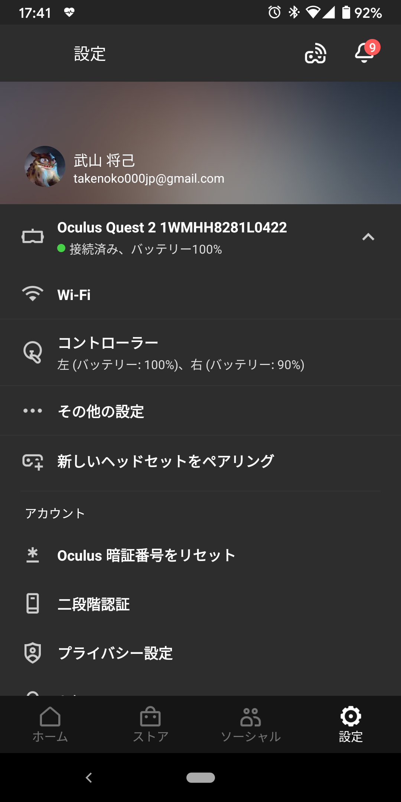

# UnityからOculusQuest2へビルドする方法

## OculusQest2 とは

<br>

### OculusQestの概要


OculusQuest2は、自分の頭に被ってVRの映像やゲームを楽しめる機器です。

VRデバイスは大きく分けて「PC接続型」「一体型」「スマホを使うVRゴーグル」の3種類があります。  
Quest 2は「一体型」です。VR内で現実と同じように体や手を動かすことができ、スマホを差し込むVRゴーグルよりもリッチな体験ができます。

VRゲーム、動画鑑賞、ネットサーフィンなど、実にさまざまなことが可能です。特にVRゲームはリズムゲームやスポーツ、ガンシューティング、ダンスといった身体を動かすタイプのものが多く、今まで遊園地やゲームセンターでしか遊べなかったようなゲームを家にいながらプレイできます。

またアバターを使って、現実では遠方にいる人たちにも会えます。マイクが内蔵されているので、バーチャル空間での会話も可能です。他にも、3Dの絵を描いたり、世界の観光地をバーチャル観光したり。VRのコンテンツは次々と登場しているので、日々「できること」が増えています。

また、Unityで制作したアプリケーションをQuest2でビルドすることも可能です。

ファイルの拡張子は『APK』ファイルなのでAndroidの開発環境が必要になります。

---

<br>

## ビルドのための準備

### 開発者アカウント作成


まずは[Oculus For Developers](https://developer.oculus.com/)というサイトへアクセスし、開発者用のアカウントを作成します。


次に、[こちら](https://developer.oculus.com/manage/)のサイトから新規でアプリケーションを作成します。


今回はVRSampleという名前でQuest用のアプリケーションを選択しました。

---

### Oculus Questの開発者モードの有効化


Oculusを開発者モードにするためにはスマートフォンのOculusアプリが必要になります。

まずはPlayStoreからOculusのアプリケーションをダウンロードしてください。

指示に従ってアカウント登録をしてください。この時Oculus側のアカウントとアプリの方のアカウントが同一でないと開発者モードにすることができないので注意してください。



Oqulusの電源を入れてスマートフォンと同じWi-Fiに繋げるとアプリ側からOculusを見つけることができます。

そうすると、「設定 → その他の設定 → 開発者モード」でOculusを開発者モードにすることができます。


USBケーブルで「Oculus Quest」とPCを接続し、Oculusを被ると許可ウィンドウが出るので許可を押してください。

この時Windowsでは「ADB」(Android Debug Bridge)のドライバのインストールも必要になるので、Windowsのかたはこちらもダウンロードしてください。

### Oculus Developer Hubのダウンロード


次に[Oculus Developer Hub](https://developer.oculus.com/downloads/package/oculus-developer-hub-mac/)をダウンロードします。

「Oculus Developer Hub」は、PCから直接Oculus Questの各種操作を行うためのツールです。


ダウンロードが完了したら、画面の指示に従ってセットアップを行ってください。


そうすると、先ほど作成したアプリケーションが表示されていると思いますので、画面左側の「My Device」を選択してください。

「Oculus Developer Hub」の機能は、次のとおりです。

- Shutdown / Restart : シャットダウンおよびリスタート。
- Cast Device : 「Oculus Quest」の映像と音をPCにキャスト。
- Screenshot : スクリーンショットを撮影。
- Record Video : 動画を撮影。
- Media Directory : スクリーンショットや動画の保存作ディレクトリを開く。
- ADB over Wi-Fi : PCから「Oculus Quest」をWi-Fi（USBケーブルなし）で操作。
- Proximity Sensor : 近接センサーの無効化。
- Guardian : ガーディアンシステムの無効化。
- OVR Metrics : パフォーマンス情報の収集。
- Install : Oculus Developer Hubの画面内にドラッグ&ドロップでapkをインストール。
- Launch / Uninstall : apkの起動およびアンインストール。 (apkが存在する時のみ表示されます)


また、上の画像のようなウィンドウが出た場合は「Change ADB Path」でADBのパスを適切に変更してください。ADBとはデバッグの際にAndroidデバイスと通信をするために使用する主なツールです。
USBで直接にまたはWi-Fi接続経由でTCP/IPにより、Androidデバイスに接続して通信することが可能です。

デバイスをUSB経由で接続するには、互換性のあるUSBケーブルを使用してデバイスをPCにつなぎます。

ここまででデバイス側の準備は一通り完了です。

Unityの時もそうでしたが、このような開発ではこの初期設定が最初の関門になっております。

また、リリースされたばかりのデバイスなどは設定画面等も刻々と変化していきますので、基本的に公式サイトを確認しながら実行してください。

---

<br>

## Unityプロジェクトの準備

では今まで作成してきたプロジェクトを使ってOculusQuest２にビルドできるようにしていきたいと思います。
ただし、現在Quest2で動かせる環境にない可能性があるのでこちらのUnityプロジェクトを複製して必ず元のデータを取っておいてください。


まずはUnityを開き、Build SettingsでAndroidを選択し、「Texture Compression」で「ASTC」を選択してください。

ASTCとはテクスチャ圧縮フォーマットの種類です。データサイズを軽くしながらも綺麗に描画されます。

テクスチャ圧縮フォーマットについて詳しく知りたい方は[こちら](https://docs.unity3d.com/ja/2018.4/Manual/class-TextureImporterOverride.html)の公式サイトをご確認ください。

<br>

次にメニュー「Edit → Project Settings → Player」のAndroidタブの「Other Settings」で以下のように設定します。


- Package Name : 任意のパッケージ名 (例: net.npaka.HelloVR)
- Minimum API Level : Android 6.0 "Mashmallow" (API Level 23)

次にメニュー「Edit → Project Settings → Quality」で以下のように設定してください。
VRアプリでは、実際の水平解像度を50%減少させるステレオレンダリングを補うために、MSAA(Multi Samplking Anti Aliasing)レベルを十分高く設定する必要があります。


- Pixel Light Count : 1。
- Texture Quality : Full Res(フル解像度)。
- Anisotropic Textures : Per Texture (テクスチャーごと)。
- Anti Aliasing : 4x。
- Soft Particles : チェックなし。
- Realtime Reflections Probes : チェックあり。
- Billboards Face Camera : チェックあり。

<br>

次にXR Plugin Frameworkを準備します。

メニュー「Edit → Project Settings → XR Plugin Management」で「Install XR Plugin Management」ボタンを押してください。


「XR Plugin Management」がインストールされます。


Androidタブの「Oculus」にチェックを入れると、
「Oculus XR Plugin」がインストールされます。

---

<br>


次にアセットストアからOculus Integrationをインポート後，OVRCameraRigをヒエラルキーにドラッグ＆ドロップしてください。


OVRCameraRig内にあるLeftHandAnchorとRightHandAnchorにOVRControllerPrefabを入れてください。

次に左右OVRControllerPrefabのインスペクターからControllerをそれぞれL Touch，R Touchに変更してください。

次にOVRCameraRigに新規スクリプト「VRScript」をアタッチしてVisualStudioでコードを以下のように追加します。

```c#
using System.Collections;
using System.Collections.Generic;
using UnityEngine;
using UnityEngine.XR;

public class VRScript : MonoBehaviour
{
    private float speed = 0.02f;
    void Update()
    {
        Move();
    }

    void Move()
    {
        //右ジョイスティックの情報取得
        Vector2 stickR = OVRInput.Get(OVRInput.RawAxis2D.RThumbstick);
        Vector3 changePosition = new Vector3((stickR.x * speed), 0, (stickR.y * speed));
        //HMDのY軸の角度取得
        Vector3 changeRotation = new Vector3(0, InputTracking.GetLocalRotation(XRNode.Head).eulerAngles.y, 0);
        //OVRCameraRigの位置変更
        this.transform.position += this.transform.rotation * (Quaternion.Euler(changeRotation) * changePosition);
    }
}
```

現在向いている方を前として右ジョイスティックを傾けた方向に進みます。

InputTracking.GetLocalRotation(XRNode.Head)でHMDの向いている方向を取得することができます。

ここまで記述できたら保存してUnityをBuidしてみましょう。

そうすると、APKファイルが出力されます。


一応Oculus Developer HubにこちらのAPKファイルを追加しておきます。

最後にパソコンとOculusQest2をUSBで繋ぎ、今度は「Build & Run」を実行してください。
きちんとパソコン、スマートフォン、Oculusが紐づいていれば自動的にビルドしたアプリがOculusで実行されているはずです。

一度この環境を構築できればあとは基本的にアプリを作ってOculusで実行する流れは問題なくできると思いますが、この1回目が一番難しいポイントで挫折することが多いので焦らずしっかりセットアップをしていきましょう。


